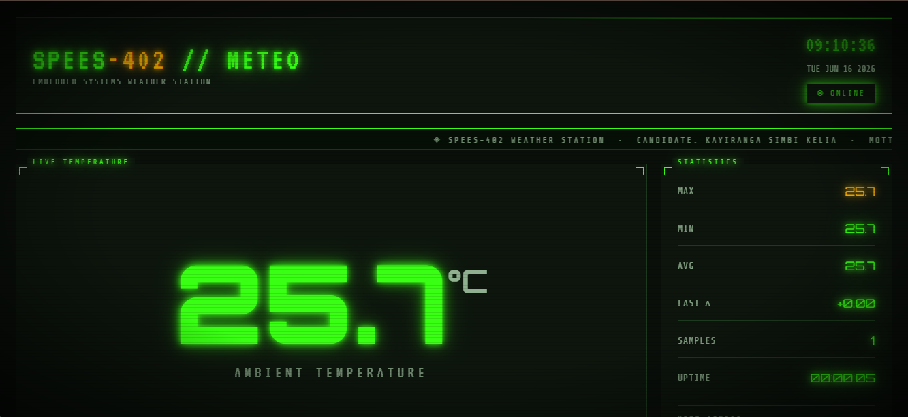

# SPEES-402 · Embedded Systems Weather Station

> **Candidate:** Kayiranga Simbi Kelia  
> **Course:** SPEES-402 — Embedded Systems  
> **Date:** June 16, 2026

---

## 📸 Dashboard Preview



---

## 📋 Project Overview

This project implements a **full-stack IoT weather station** for the SPEES-402 Embedded Systems exam. A DHT11 temperature sensor is read by an Arduino UNO, displayed on a 16×2 LCD screen, and simultaneously published over **MQTT** to a VPS broker. A retro-styled browser dashboard then subscribes to the live temperature feed and visualises the data in real time.

---

## 🏗️ System Architecture

```
┌──────────────────────────────────────────────────────────────────────────┐
│                        DATA FLOW OVERVIEW                                │
│                                                                          │
│  ┌─────────────┐   Serial/UART    ┌──────────────┐   MQTT TCP (QoS 1)  │
│  │  Arduino    │─────────────────▶│  weather.py  │────────────────────▶ │
│  │  UNO        │   9600 baud      │  (Python)    │                      │
│  │  + DHT11    │   TEMP:25.5\n    └──────────────┘       │              │
│  │  + LCD I2C  │                                          ▼              │
│  └─────────────┘                                ┌──────────────────┐    │
│                                                 │  VPS MQTT Broker │    │
│                                                 │ 157.173.101.159  │    │
│  ┌─────────────┐   WebSocket      ┌──────────┐  │    Port: 24022   │    │
│  │  Browser    │◀─────────────────│ bridge.py│◀─│                  │    │
│  │  Dashboard  │  localhost:8765  │ (Python) │  └──────────────────┘    │
│  │  (HTML)     │                  └──────────┘                          │
│  └─────────────┘                                                        │
│         ▲                                                                │
│         └─── also tries Paho MQTT JS direct on port 24022 (if WS)       │
└──────────────────────────────────────────────────────────────────────────┘
```

### MQTT Topic
```
spees402/temperature/Kayiranga Simbi Kelia
```

---

## 📁 File Structure

```
Embedded exam/
├── weather.py          # Reads Arduino serial → publishes to MQTT broker
├── bridge.py           # MQTT subscriber → WebSocket relay for browser
└── dashboard.html      # Retro browser dashboard (open directly in browser)

Downloads/exam/exam/arduino_temp_lcd/
└── arduino_temp_lcd.ino  # Arduino sketch (DHT11 + LCD + Serial)
```

---

## 🔧 Hardware

| Component | Model | Connection |
|-----------|-------|------------|
| Microcontroller | Arduino UNO | USB → PC (COM7) |
| Temperature Sensor | DHT11 | Digital Pin D2 |
| Display | 16×2 LCD with I2C backpack | SDA=A4, SCL=A5 |
| Interface | I2C (address `0x27`) | Wire library |

### Wiring Diagram

```
Arduino UNO
──────────────────────────────
Pin D2   ──▶  DHT11 DATA
Pin A4   ──▶  LCD SDA  (I2C)
Pin A5   ──▶  LCD SCL  (I2C)
5V       ──▶  DHT11 VCC, LCD VCC
GND      ──▶  DHT11 GND, LCD GND
```

---

## 💾 Arduino Sketch — `arduino_temp_lcd.ino`

**Libraries required** (install via Arduino IDE → Library Manager):
- `LiquidCrystal_I2C` by Frank de Brabander
- `DHT sensor library` by Adafruit
- `Wire` (built-in)

**Key behaviour:**
- Reads DHT11 every **2 seconds**
- Prints `TEMP:25.50` to Serial at **9600 baud**
- Row 0 of LCD: candidate name (scrolls if > 16 chars)
- Row 1 of LCD: `Temp: 25.5 C`

```cpp
// Serial output format:
Serial.print("TEMP:");
Serial.println(currentTemp);   // e.g.  TEMP:25.50

// LCD output:
// Row 0:  BYIRINGIRO Samuel   (scrolling)
// Row 1:  Temp: 25.5 C
```

---

## 🐍 Python Scripts

### `weather.py` — Serial → MQTT Publisher

Reads temperature lines from the Arduino over USB Serial and publishes each value to the MQTT broker.

**Configuration (top of file):**

```python
SERIAL_PORT = "COM7"                     # ← change to your Arduino's port
BAUD_RATE   = 9600
CANDIDATE   = "Kayiranga Simbi Kelia"    # ← must match intended topic
VPS_HOST    = "157.173.101.159"
VPS_PORT    = 24022
MQTT_TOPIC  = f"spees402/temperature/{CANDIDATE}"
```

**Run:**
```powershell
python weather.py
```

**Expected output:**
```
[MQTT] Connecting to 157.173.101.159:24022 ...
[MQTT] Connected (code 0)
[Serial] Opening COM7 at 9600 baud ...
[Serial] Port open. Listening ...

────────────────────────────────────────
  Topic : spees402/temperature/Kayiranga Simbi Kelia
  Port  : COM7
────────────────────────────────────────

[09:05:58] Temperature: 23.5 °C  →  published to spees402/temperature/Kayiranga Simbi Kelia
[09:06:00] Temperature: 23.5 °C  →  published to spees402/temperature/Kayiranga Simbi Kelia
```

---

### `bridge.py` — MQTT → WebSocket Relay

Browsers cannot open raw TCP MQTT connections. `bridge.py` solves this by acting as a relay: it subscribes to the MQTT topic over TCP and re-broadcasts each message to all connected browser tabs over WebSocket.

```
weather.py ──TCP MQTT──▶ Broker ──TCP MQTT──▶ bridge.py ──WebSocket──▶ Browser
```

**Run:**
```powershell
python bridge.py
```

**Expected output:**
```
================================================
   SPEES-402  –  MQTT → WebSocket Bridge  v2
================================================

┌─────────────────────────────────────────────────┐
│           Available Serial / COM Ports           │
├─────────────────────────────────────────────────┤
│  COM7       USB-SERIAL CH340                    │
└─────────────────────────────────────────────────┘

[MQTT] Connecting to 157.173.101.159:24022 …
[WS]   Listening on ws://localhost:8765  (websockets new API)
[WS]   Open dashboard.html in your browser now.

[MQTT] Connected OK
[MQTT] Subscribed → spees402/temperature/Kayiranga Simbi Kelia

[WS]   Browser connected from ('127.0.0.1', 52341)
[MQTT] ← 23.5 °C
[MQTT] ← 23.5 °C
```

---

## 🖥️ Dashboard — `dashboard.html`

A retro CRT-style live temperature dashboard. Open directly in any browser — no web server required.

### Features

| Feature | Description |
|---------|-------------|
| 🟢 **Live Temperature** | Giant Orbitron-font display, color-coded (green → amber → red) |
| 📊 **History Chart** | Vanilla canvas line chart, last 30 readings |
| 🌡️ **Thermometer Gauge** | Animated fill from 0 °C to 60 °C |
| 📈 **Statistics** | Max, Min, Avg, Last Δ, Sample count, Uptime |
| 📜 **System Log** | Real-time scrollable event log |
| 🔄 **Auto-reconnect** | Exponential backoff on disconnect |
| 🎬 **Demo Mode** | Simulated data until real MQTT arrives |
| 🔗 **Dual Connection** | Tries direct WebSocket MQTT + local bridge simultaneously |

### Connection Strategy

The dashboard tries **two methods at the same time**:

| Strategy | Method | Status Label |
|----------|--------|--------------|
| **A** | Paho MQTT JS → `157.173.101.159:24022` (if broker exposes WebSocket) | `MQTT LIVE` |
| **B** | Native WebSocket → `ws://localhost:8765` (via `bridge.py`) | `BRIDGE LIVE` |

Whichever delivers data first wins. The status pill in the top-right corner shows which method is active.

### Status Indicator

| Colour | Meaning |
|--------|---------|
| 🟢 Green `ONLINE` | Receiving live temperature data |
| 🟡 Amber `CONNECTING` | Trying to connect |
| 🔴 Red `OFFLINE` | No connection — retrying |

---

## 🚀 Quick Start

### Prerequisites

```powershell
pip install pyserial paho-mqtt websockets
```

### Step-by-Step

**1. Flash the Arduino**
- Open `arduino_temp_lcd.ino` in Arduino IDE
- Select board: **Arduino UNO**
- Select the correct COM port
- Upload

**2. Find your COM port**
- Open Device Manager → Ports (COM & LPT)
- Look for `USB-SERIAL CH340` or `Arduino UNO`
- Update `SERIAL_PORT` in `weather.py` accordingly

**3. Start the MQTT publisher**
```powershell
cd "c:\Users\HP\Documents\Embedded exam"
python weather.py
```

**4. Start the WebSocket bridge** *(in a new terminal)*
```powershell
cd "c:\Users\HP\Documents\Embedded exam"
python bridge.py
```

**5. Open the dashboard**
```powershell
Start-Process "dashboard.html"
```

> The dashboard will show `[DEMO]` simulated readings immediately, then switch to live data once the MQTT stream is active.

---

## 🔌 MQTT Details

| Parameter | Value |
|-----------|-------|
| Broker Host | `157.173.101.159` |
| TCP Port | `24022` |
| Topic | `spees402/temperature/Kayiranga Simbi Kelia` |
| QoS | `1` |
| Retain | `true` |
| Auth | None (anonymous) |

---

## 📦 Dependencies

### Python

| Package | Version | Purpose |
|---------|---------|---------|
| `pyserial` | ≥ 3.5 | Read Arduino USB serial |
| `paho-mqtt` | ≥ 2.0 | MQTT client (TCP) |
| `websockets` | ≥ 14.0 | WebSocket server in bridge |

### Arduino

| Library | Purpose |
|---------|---------|
| `DHT sensor library` (Adafruit) | Read DHT11 temperature |
| `LiquidCrystal_I2C` (Frank de Brabander) | Drive I2C LCD |
| `Wire` (built-in) | I2C communication |

### Browser (CDN, no install)

| Library | Purpose |
|---------|---------|
| Paho MQTT JS 1.0.1 | Direct WebSocket MQTT |
| Google Fonts (Orbitron, VT323, Share Tech Mono) | Retro styling |

---

## 🛠️ Troubleshooting

### ❌ `Cannot open serial port: COM7`
- Unplug and replug the Arduino USB cable
- Check Device Manager for the correct COM port number
- Update `SERIAL_PORT = "COM3"` (or whatever it shows) in `weather.py`

### ❌ `ConnectionRefusedError` in weather.py
- The MQTT broker at `157.173.101.159:24022` is unreachable
- Check your network/VPN connection
- Confirm the port with your exam instructor

### ❌ Dashboard stays OFFLINE
- Make sure `bridge.py` is running in a separate terminal
- Check Windows Firewall isn't blocking port `8765`
- Look at the System Log in the dashboard for detailed error messages

### ❌ LCD shows garbled characters
- The I2C address might be `0x3F` instead of `0x27`
- Change `LiquidCrystal_I2C lcd(0x27, 16, 2)` → `lcd(0x3F, 16, 2)`

---

## 📐 Data Flow — Sequence

```
Arduino DHT11
    │  reads temp every 2s
    ▼
Serial.print("TEMP:25.50\n")   ← 9600 baud, COM7
    │
    ▼
weather.py
    │  parses "TEMP:" prefix
    │  client.publish(topic, "25.50", qos=1, retain=True)
    ▼
MQTT Broker (157.173.101.159:24022)
    │  stores retained message
    ├─────────────────────────────────────▶ bridge.py subscribes
    │                                              │
    │                                        asyncio broadcast
    │                                              ▼
    │                                   ws://localhost:8765
    │                                              │
    └──────────────────────────────────────────────▶ dashboard.html
                                                      onNewTemp(25.50)
                                                      → updates display
```

---

## 👤 Author

| Field | Value |
|-------|-------|
| **Name** | Kayiranga Simbi Kelia |
| **Course** | SPEES-402 Embedded Systems |
| **Institution** | — |
| **Year** | 2026 |

---

*SPEES-402 Weather Station — Embedded Systems Exam Project*
